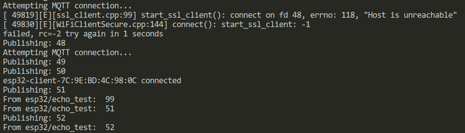

## Bố trí thí nghiệm 

- Dùng thư viện PubSubClient trên ESP32 kết nối với một MQTT Broker (trên đám mây hoặc local đều được).
- Sử dụng thư viện Ticker, một thư viện chuẩn trong Arduino để gọi hàm publish một cách đều đặn và bất đồng bộ, mỗi giây (1s) một lần:
    + Mã: `mqttPulishTicker.attach(1, mqttPublish)`
    + Tài liệu về Ticker: https://docs.arduino.cc/libraries/ticker/, https://github.com/espressif/arduino-esp32/blob/master/libraries/Ticker/src/Ticker.h 
- Subscribe tới topic `esp32/echo_test` ngay sau khi MQTT connect thành công
- Gọi hàm `mqttClient.loop()` trong main loop để handle các thông điệp nhận được từ broker (bất đồng bộ, event driven) bất kỳ lúc nào. 
- Phát hiện mất kết nối MQTT `if (!mqttClient.connected())` trong main loop để kết nối lại `mqttReconnect()` ngay khi phát hiện mất kết nối.

## Kịch bản thí nghiệm

- Sau khi ESP32 khởi động, sẽ kết nối WiFi vào một điểm phát AP đã định (ssid, và pass trong secrets/wifi.h) --> thành công
- Sẽ thấy MQTT Client kết nối đến broker thành công và bắt đầu gửi (publish) và nhận (subscribe) số đếm tăng dần trong `echo_topic` đều đặn
- Khi đó sẽ tiến hành ngắt điểm phát WiFi, tiện nhất là phát wifi từ điện thoại để bật ngắt nó nhanh chóng trong tầm tay
- Quan sát phản ứng của MQTT Client trong mã khi mất kết nối WiFi giữa chừng, 
- sau đó bật lại điểm phát WiFi và quan sát khả năng khôi phục kết nối, và quan sát việc mất gói tin trong quá trình kết nối.

## Mục đích 
- Xem việc ngắt kết nối từ bên dưới chồng Internet Protocol có ảnh hưởng tới lớp trên không. Ở đây là lớp WiFi (link layer) bị ngắt --> lớp TCP/IP bị ngắt --> có ảnh hưởng tới lớp ứng dụng MQTT trên cùng hay không? ESP core lib sẽ in ra thông điệp lỗi như nào (có báo lỗi từ lớp dưới lên lớp bên trên hay không?)
- Quan sát sự bỏ mặc việc mất thông điệp trong QoS = 0. 
- Hiểu rõ hơn về cơ chế hoạt động của MQTT client bên trên tầng TCP/IP, nhất là cơ chế phát hiện mất kết nối và khôi phục kết nối ở lớp vật lý, rất hay xảy ra trong thực tế.

## Kết quả
Quan sát thông điệp in ra theo thời gian ta thấy một vài điều:

**Hình 1**

- Quá trình Kết nối WiFi và Cách Thức Hoạt Động:
    Ban đầu, ESP32 tìm cách kết nối với WiFi bằng cách sử dụng tên mạng (SSID) là Binhngungok. Đây là bước đầu tiên và bắt buộc để thiết bị có thể truy cập vào mạng cục bộ và giao tiếp với các thiết bị khác, bao gồm cả MQTT broker.
    Sau khi thực hiện kết nối, ESP32 nhận được địa chỉ IP là 192.168.0.104. Địa chỉ IP này cho phép thiết bị định danh trong mạng và có thể được sử dụng để gửi hoặc nhận dữ liệu từ các thiết bị khác.
- Thời gian Kết nối WiFi So với MQTT:
    Có thể thấy rằng việc kết nối WiFi diễn ra nhanh chóng và không có độ trễ rõ ràng trong quá trình này.
    Ngay sau khi kết nối WiFi thành công, thiết bị bắt đầu quá trình kết nối MQTT với broker. Tuy nhiên, thiết lập kết nối MQTT cần thêm thời gian (khoảng 3 giây), vì quá trình này đòi hỏi thêm bước xác thực và thiết lập liên kết với broker.
- Vai trò của WiFi trong Hoạt động của ESP32:
Kết nối WiFi không chỉ là yếu tố tiên quyết để kết nối với MQTT broker mà còn cung cấp kênh truyền tải chính cho mọi giao tiếp của ESP32 trong mạng.
Vì mạng cục bộ WiFi đảm bảo mức độ ổn định tương đối, các thông điệp MQTT được truyền tải và nhận về từ broker một cách đáng tin cậy, ngay cả khi sử dụng mức QoS thấp nhất (QoS 0). Điều này giúp đơn giản hóa giao thức giao tiếp mà không cần đến việc bảo vệ gói tin ở mức cao hơn.
## Tổng kết
Nhờ kết nối WiFi ổn định, ESP32 có thể dễ dàng thiết lập kết nối MQTT và hoạt động theo cơ chế Echo một cách mượt mà, không gặp phải hiện tượng mất gói tin. Kết nối WiFi đóng vai trò thiết yếu, tạo nền tảng cho mọi giao tiếp mạng của thiết bị.

)
**Hình 2**

## Khi ngắt điểm phát WiFi (AP):
- Ngắt kết nối WiFi: Khi ngắt tín hiệu từ bộ phát WiFi (như khi tắt WiFi trên điện thoại), lập tức ssl_client ở lớp dưới của ESP32 báo lỗi, cụ thể là dòng ssl_client.cpp:37 ..., với mã lỗi errno: 118, báo rằng "Host is unreachable". Điều này nghĩa là SSL Client nhận biết ngay khi WiFi bị mất.

- Tiếp tục gửi thông điệp: Dù đã mất kết nối WiFi, thư viện PubSubClient vẫn tiếp tục gửi thông điệp đều đặn mỗi giây, từ thông điệp số 27 đến 41, trong khoảng 15 giây. Điều này cho thấy PubSubClient không nhận biết ngay rằng kết nối đã bị ngắt.

- Phát hiện mất kết nối sau 15 giây: Đúng 15 giây sau khi WiFi bị ngắt, MQTT Client mới nhận ra rằng kết nối MQTT đã mất và bắt đầu thực hiện mqttReconnect. Thông báo lỗi failed, rc=-2 xác nhận rằng lúc này PubSubClient mới phát hiện mạng bị mất.

- Kết nối lại tự động khi có WiFi: Khi mình bật lại điểm phát WiFi, thư viện WiFi.h của ESP32 tự động xử lý việc kết nối lại WiFi mà không cần phải viết thêm mã. Và sau khi WiFi được khôi phục, việc kết nối lại MQTT mất thêm khoảng 3 giây nữa.

Điều này cho thấy:

WiFi.h của ESP32 tự động xử lý việc kết nối lại WiFi một cách âm thầm mà không cần người dùng can thiệp.
PubSubClient phát hiện mất kết nối với độ trễ 15 giây – có thể đây là thời gian timeout mặc định khi không nhận được phản hồi từ server.

**Hình 3**

## Side Note về việc sử dụng Wokwi simulator trên VS code

- Gần đây có thể cài đặt extension Wokwi trên VS code để mô phỏng phần cứng ESP32 cùng với kết nối WiFi từ chính máy tính người dùng. 
- ... hứa hẹn tăng tốc việc thử nghiệm các ý tưởng trên phần cứng ESP32 mà mất thời gian nạp code và bố trí phần cứng thực bên ngoài. 
- Link: https://docs.wokwi.com/vscode/getting-started/ 
- Tuy nhiên: ban đầu tôi chạy thí nghiệm này trên Wokwi và Không Thành Công, vì lý do Wokwi nó vẫn bắt phải có kết nối internet để quản lý giấy phép trả tiền của nó (khá thất vọng!) cho nên không thể dùng mô phỏng này để thử nghiệm việc mất kết nối vật lý. ("Wokwi required internet connection, ... please paid version!")
- Kết luận: Những thí nghiệm chuyên sâu về các kịch bản ngoài mong muốn (edge case) của phần cứng, vẫn phải dùng phần cứng thật. 

## Kết luận 

Việc "làm các thí nghiệm" trong công nghệ lập trình là vô cùng hữu ích ở nhiều phương diện:

- hiểu rõ hơn về tương tác của các thành phần trong mã
- hiểu rõ hơn về các trường hợp không được nói trong tài liệu nhưng có thể xảy ra trong thực tế (edge cases)
- giúp người lập trình hiểu rõ hơn về API của các thư viện mình sắp dùng 
- cũng là quá trình tiếp cận các thư viện và công nghệ mới hiệu quả vì nó cần phải động não mà cũng khá đơn giản.

## Gợi ý các ý tưởng thí nghiệm cho người học 

- Các bạn nên lặp lại thí nghiệm này trên một MQTT broker khác ngoài EMQX, ví dụ thiết lập tài khoản HiveMQ và đặt các thông số kết nối trong mã như ca_cert và username và password của chính bạn. Đây là một thực tập cần thiết để biết cách thiết lập một MQTT Broker sử dụng dịch vụ online. Các bạn hoàn toàn có thể sử dụng tài nguyên miễn phí mà hiveMQ cung cấp. 
- Tự cài đặt `https://mosquitto.org/` broker trên máy cá nhân để thực tập việc cài đặt một MQTT broker trên server riêng sau này mà không phụ thuộc vào dịch vụ của bên thứ 3. Sau đó lặp lại thí nghiệm này. Việc này là vô cùng hữu ích cho công việc tương lai. Các bạn có thể phải đọc tài liệu để biết phải thiết lập kết nối không mã hóa (cổng 1883) và kết nối TLS bằng việc tự phát ra chứng chỉ cho máy chủ của mình như thế nào.
- Các bạn có thể thử thiết đặt một trong hai tham số `mqttClient.setKeepAlive(keepAlive)`, `mqttClient.setSocketTimeout(socketTimeout)` như tôi đã comment trong mã để thấy rằng thời gian phát hiện ra việc mất kết nối của mqtt client có thể giảm xuống thấp hơn giá trị mặc định là 15s như quan sát bên trên, thông qua 1 trong hai thông số này. 
